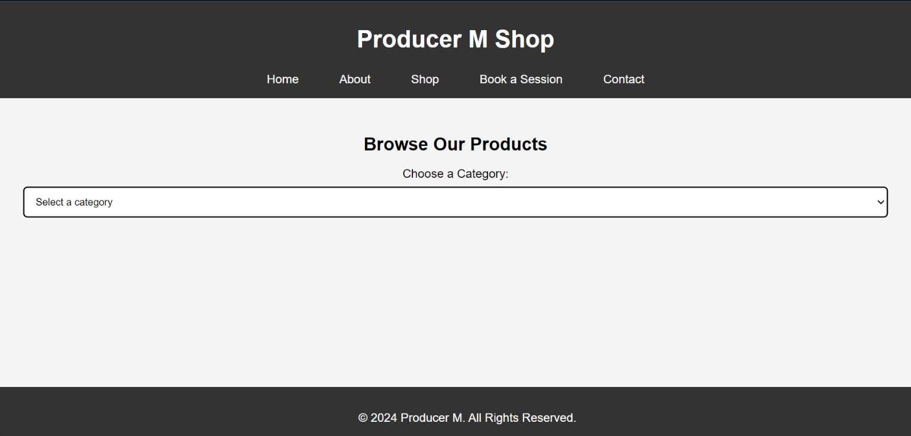

# Producer M Website

Welcome to the official repository for **Producer M's Website**. This project is part of a front-end web development assignment, which features a minimalist design for a music producer’s portfolio and shop.

## Live Website
The website is live and can be viewed at the following URL:
[Producer M Website](https://abukhulu.github.io/Producer-M-Website/)

## Features
- **Landing Page**: The main page with large text "PRODUCER M" as the background.
- **Dashboard**: Links to different sections of the website.
- **About**: Introduction and bio for Producer M.
- **Shop**:
  - Beats (one beat: **RED**).
  - Merchandise (coming soon).
  - Drumkits (featuring Producer M's **Stash**).
- **Contact**: A section to send messages and book a session, featuring forms with text boxes, radio buttons, checkboxes, and date pickers.

## Screenshots of Pages
1. **Home page**
   
   
2. **About page**:
   
   
3. **Shop page**
   
   
4. **Contact page*
   
   
5. **Form Page**
   

## Technologies Used
- **HTML5**: For structuring the content.
- **CSS3**: External stylesheets for styling the website.
- **JavaScript**: External scripts for interactive functionality.

## Assignment Requirements
This project was developed as part of a front-end web development lab task, involving:
- Creating a 5-page interactive website.
- Implementing forms for user input.
- Utilizing external CSS and JavaScript for all pages.
- Hosting the website on GitHub Pages.

## How to Clone and Run Locally
1. Clone the repository to your local machine:
   ```bash
   git clone https://github.com/abukhulu/Producer-M-Website.git
